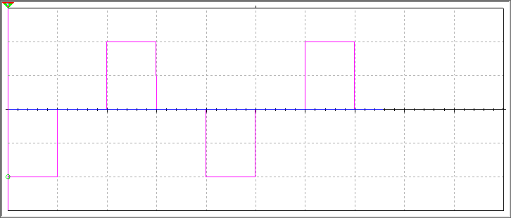
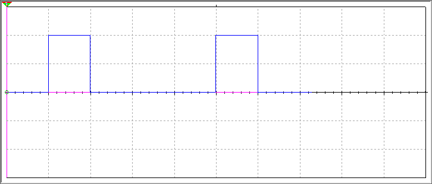

<h1>个人自用电路仿真</h1></h1>

- [双三极管镜像防倒灌电路(Dual Transistor Mirror Anti - Backflow Circuit)](# 双三极管镜像防倒灌电路(Dual Transistor Mirror Anti - Backflow Circuit))
- [电压传递(Voltage Transfer)](# 电压传递(Voltage Transfer))
- [倍压电路(voltage-multiplying circuit)](# 倍压电路(voltage-multiplying circuit))
- [与门滤波电路](# 与门滤波电路)
- [大电压启动电路](# 大电压启动电路)

### 双三极管镜像防倒灌电路(Dual Transistor Mirror Anti - Backflow Circuit)

当输入端有电流时，输入端的电流通过电阻为三极管提供偏置电流，使三极管工作在放大区。三极管1的集电极电流成为三极管2的参考电流，三极管2的集电极电流与三极管1的集电极电流几乎相同，形成电流镜像。此时，MOS管的栅极电压被控制在一个合适的范围内，使得MOS管导通，电流从输入端流向输出端，为负载电路提供电流。当输出端出现异常，如负载电路短路或电压高于输入端时，三极管2的基极电压会随着输出端电压的升高而升高。当输出端电压高于输入端电压时，三极管2的基极-发射极电压不足以使其导通，从而使三极管2截止，切断电流路径。同时，MOS管的栅极电压也会发生变化，使得MOS管截止，进一步防止电流倒灌到输入电路。

| 元器件       | 参数及要求           | 推荐范围/标准                                                                 |
|--------------|----------------------|------------------------------------------------------------------------------|
| 三极管1      | 电流增益（β）        | 选择β值较高且稳定的三极管，一般β值在100-200之间为宜，如2N3904（β约200-300） |
|             | 耐压值（Vceo）       | 根据电路工作电压选择，若工作电压5V，选Vceo≥10V；12V电路选Vceo≥20V           |
|             | 最大允许功耗（Pcm）  | 根据电路负载电流和电压计算功耗，确保功耗裕量足够，如负载电流100mA、电压5V时，三极管功耗约0.5W，选Pcm≥1W |
| 三极管2      | 电流增益（β）        | 与三极管1特性匹配，β值接近且稳定，如2N3906（β约50-300）                     |
|             | 耐压值（Vceo）       | 同三极管1的选型标准                                                          |
|             | 最大允许功耗（Pcm）  | 同三极管1的选型标准                                                          |
| MOS管        | 漏源耐压（Vds）      | 根据电路工作电压选择，一般Vds≥2倍工作电压，如工作电压12V，选Vds≥25V          |
|             | 导通电阻（Rds(on)）  | 选择Rds(on)较小的MOS管，一般小于0.1Ω，以降低导通损耗                         |
|             | 栅极阈值电压（Vth）  | 选择Vth适中的MOS管，一般在2-4V之间，确保可靠导通和截止                        |
| 电阻1（偏置电阻） | 阻值精度           | 选择精度为±5%或±1%的电阻，保证偏置电压的准确性                               |
|             | 功率                 | 根据通过的电流和承受的电压计算功率，一般选择功率裕量为2-3倍的电阻            |
|             | 温度系数             | 选择温度系数较低的电阻，一般在±100ppm/℃以下                                 |
| 电阻2（限流电阻） | 阻值精度           | 同电阻1的选型标准                                                            |
|             | 功率                 | 同电阻1的选型标准                                                            |
|             | 温度系数             | 同电阻1的选型标准                                                            |

###  电压传递(Voltage Transfer)

#### 单向传递

当输入端为低电平 0V 时，三极管导通，输出端被拉低到接近 0V；当输入端为高电平时，三极管截止，输出端靠着上拉电阻变成高电平。

1.png)

| 元器件      | 参数及要求   | 推荐范围/标准                                                |
| ----------- | ------------ | ------------------------------------------------------------ |
| 二极管      | 正向导通电压 | 一般在 0.7V 左右，反向耐压根据实际电路电压选择，需大于电路中的最高电压。 |
|             | 反向恢复时间 | 选择反向恢复时间较短的二极管，以适应高频信号，如 1N4148。    |
|             | 最大正向电流 | 根据电路实际电流需求选择，需保证在正常工作电流下稳定工作。   |
| 上拉电阻 R1 | 阻值         | 一般阻值在 1KΩ - 10KΩ 之间，具体可根据实际电路需求和信号传输特性进行选择。 |
|             | 功率         | 根据通过的电流和承受的电压计算功率，一般选择功率裕量为 2 - 3 倍的电阻。 |
|             | 温度系数     | 选择温度系数较低的电阻，一般在 ±100ppm/℃以下。               |

当输入为低电平时，三极管 Q1 关断，Q2 导通，输出端被拉低；当输入为高电平时，Q1 导通，Q2 关断，输出端被上拉电阻拉高。

2.png)

| 元器件             | 参数及要求          | 推荐范围/标准                                                |
| ------------------ | ------------------- | ------------------------------------------------------------ |
| 三极管 1（NPN 型） | 电流增益（β）       | 选择 β 值较高且稳定的三极管，一般 β 值在 100 - 200 之间为宜，如 2N3904（β 约 200 - 300）。 |
|                    | 耐压值（Vceo）      | 根据电路工作电压选择，若工作电压 5V，选 Vceo≥10V；12V 电路选 Vceo≥20V。 |
|                    | 最大允许功耗（Pcm） | 根据电路负载电流和电压计算功耗，确保功耗裕量足够，如负载电流 100mA、电压 5V 时，三极管功耗约 0.5W，选 Pcm≥1W。 |
| 三极管 2（PNP 型） | 电流增益（β）       | 与三极管 1 特性匹配，β 值接近且稳定，如 2N3906（β 约 50 - 300）。 |
|                    | 耐压值（Vceo）      | 同三极管 1 的选型标准。                                      |
|                    | 最大允许功耗（Pcm） | 同三极管 1 的选型标准。                                      |
| 上拉电阻 R4        | 阻值                | 阻值一般在 1KΩ - 10KΩ 之间，需满足电路信号电平转换的需求。   |
|                    | 功率                | 同电阻 1 的选型标准。                                        |
|                    | 温度系数            | 同电阻 1 的选型标准。                                        |

#### 双向传递

从左向右看，当输入为高电平时，MOS 管 VGS = 0，不导通，输出电平被上拉为高电平；当输入为低电平时，MOS 管 VGS = VDD，导通，输出的电平与输入相等。

从右向左看，当输入为高电平时，若左侧输出为高电平，MOS 管 VGS = 0，不导通，左侧保持高电平；当输入为低电平时，正常情况下左侧输出为高电平，MOS 管 VGS = 0，不导通，但由于 MOS 管的寄生二极管，会把输出下拉至低电平，进而使 MOS 管导通，输出和输入两端都为低电平。

.png)

| 元器件            | 参数及要求          | 推荐范围/标准                                                |
| ----------------- | ------------------- | ------------------------------------------------------------ |
| MOS 管            | 漏源耐压（Vds）     | 根据电路工作电压选择，一般 Vds≥2 倍工作电压，如工作电压 12V，选 Vds≥25V。 |
|                   | 导通电阻（Rds(on)） | 选择 Rds(on) 较小的 MOS 管，一般小于 0.1Ω，以降低导通损耗。  |
|                   | 栅极阈值电压（Vth） | 选择 Vth 适中的 MOS 管，一般在 2 - 4V 之间，确保可靠导通和截止。 |
| 上拉电阻 R10、R11 | 阻值                | 一般阻值在 1KΩ - 10KΩ 之间，根据实际电路需求和信号传输特性进行选择。 |
|                   | 功率                | 同电阻 1 的选型标准。                                        |
|                   | 温度系数            | 同电阻 1 的选型标准。                                        |

###  倍压电路(voltage-multiplying circuit)

交流输入在正负半周交替通过 D1-D4 四只二极管给 C1-C4 四只电容逐级充电，每一级电容都以前一级的输出为基准再抬高一个输入峰值电压，四只电容的电压串联叠加，使 0.5 V 的输入峰值最终整流升压到约 2 V 直流输出，实现四倍压效果。

| 元器件       | 参数及要求         | 推荐范围/标准（含理论计算与理由）                            |
| ------------ | ------------------ | ------------------------------------------------------------ |
| 二极管 D1–D4 | 反向耐压 $V_{RRM}$ | $≥2 V_{out} = 2×2 V = 4 V$；工程取$ ≥5 V$，留裕量并覆盖温漂、尖峰。 |
|              | 正向电流 IF        | $≥Iload = 2 V / 100 kΩ = 20 µA$；选$ ≥100 mA $即可（通用贴片肖特基）。 |
|              | 正向压降 VF        | $≤0.3 V$（低压倍压每级仅 $0.5 V$，$VF $越低效率越高）。      |
| 电容 C1–C4   | 容量 C             | 纹波 $ΔV ≤ 5\% Vout ⇒ C ≥ Iload / (f·ΔV) = 20 µA / (1 kHz×0.1 V) = 0.2 µF$；工程选$ 1 µF $留裕量。 |
|              | 额定电压 Vr        | $≥2 Vpk = 1 V$；工程取$ ≥10 V$，兼顾工艺余量。               |
|              | 介质/温度特性      | $X7R$ 或更好，$−55 °C~125 °C $容量漂移 $< ±15 %$，适合 $1 kHz $充放电。 |
| 负载电阻 R1  | 阻值               | 由期望负载电流 Iload 决定：$R = Vout / Iload$；若设定 $Iload = 20 µA、Vout = 2 V$，则 $R = 100 kΩ$。 |
|              | 功率               | P = V² / R = (2 V)² / 100 kΩ = 0.04 mW；选 1/8 W (0.125 W) 厚膜电阻，余量 >3000×。 |
|              | 精度 & 温漂        | ±5 %、±100 ppm/°C 厚膜 0805 即可，温漂在 100 °C 范围内仅约 1 %，不影响 2 V 输出精度。 |

### 与门滤波电路

利用RC电路将信号跳变**延迟**，再通过与门将**延迟后的信号**与**原始信号**进行对比。只有当原始信号是**稳定且有效的跳变**时，输出才会跟随。短暂的毛刺则无法通过。

我们以一个**正毛刺（Positive Glitch）** 滤除为例，分析输入信号从低电平（0）跳变到高电平（1）时的情况。

当输入信号 $V_{in}(t)$ 保持稳定逻辑电平时：直接路径输入端 $A$ 与输入信号同相,RC路径输入端 $B$ 电压 $V_C(t)$ 等于输入信号电平（充电完成状态）,输出 $V_{out} = A \cdot B$ 与输入信号一致

当输入信号发生逻辑跳变时，电路表现出滤波特性：输入 $V_{in}(t)$ 跃变为高电平 $V_{DD}$ 后：$V_A(t) = V_{DD}$,$V_B(t) = V_C(t) = V_{DD} \cdot (1 - e^{-t/RC})$.与门输出保持低电平直至：$V_C(t) > V_{IH}$.输出有效高电平的延迟时间 $t_d$ 由$V_{IH} = V_{DD} \cdot (1 - e^{-t_d/RC})$决定,即：
$$
t_d = -RC \cdot \ln(1 - \frac{V_{IH}}{V_{DD}})
$$
对于宽度 $T_w$ 的高电平脉冲干扰,若 $T_w < t_d$，则电容电压 $V_C(t)$ 在脉冲结束前始终低于 $V_{IH}$，满足：$V_A(t) \cdot V_B(t) = 0$与门输出保持低电平，脉冲被完全滤除。

对于一个稳定的电路来说,电路引入的传输延迟为:
$$
t_{delay} = -RC \cdot \ln(1 - \frac{V_{IH}}{V_{DD}})
$$

### 大电压启动电路

当低电压信号为低电压或高阻态时,三极管基极被拉低到地，为低电平,三极管不导通,进而$MOS$管的$V_{gs} = 0$，$MOS$管不导通，$V_{OUT }$无输出。电阻R是为了在$ Control $为高阻时，将三极管的基极固定在低电平，不让其浮空。

当电源$V_{IN}$刚上电时，要求控制电源开关的输入信号$ Control 为$低电平或高阻，即关闭三极管，从而关闭$MOS$管。因$V_{IN} $还不稳定，不能将电源打开向后级电路输出。此时电源$V_{IN}$刚上电，使$MOS$管$G$极与$S$极等电势，即$V_{gs} = 0$，令$MOS管$关闭。电源$V_{IN} $上电完成后，$MOS$管$G$极与$S$极两端均为$V_{IN}$，仍然$V_{gs} = 0$。

此时将$ Control $设为高电平（假设高电平为$3.3V$），则：

①三极管的基极为$0.7V$，可算出基极电流$I_{be}$

②三级管饱和导通，$V_{ce} ≈ 0$。电容$C_1$通过电阻$R_2$充电，即$C_1$与$G$极相连端的电压由$V_{IN}$缓慢下降到$0V$，导致$V_{gs}$电压逐渐增大。

③$MOS$管的$V_{gs}$缓慢增大，令其缓慢打开直至完全打开。最终$V_{gs} = V_{IN}$。

④利用电容$C_1$的充电时间实现了$MOS$管的缓慢打开（导通），实现了软开启的功能。

电源打开后，$V_{OUT }$输出为$V_{IN}$电压。此时将$ Control $设为低电平，三极管关闭，电容$C_1$与$G$极相连端通过电阻$R_2$放电，电压逐渐上升到$V_{IN}$，起到软关闭的效果。软关闭一般不是我们想要的，过慢地关闭电源，可能出现系统不稳定等异常。

### 双电源自动切换电路

当$V_{DD}$断开时,$R_6$上端电压因为下拉电阻的存在,被拉低到0V,$MOS$的$U_{gs} = V_{cc} > 0$,$MOS$管全导通,输出$V_{cc}$.当$V_{DD}$接入时,$R_6$上端电压被拉高到$V_{DD}$,$Q_4$的$U_{gs} = V_{cc} - V_{DD} < 0$,$Q_4$截止,导致无电压通过,输出为$V_{DD} - V_{f}$.
